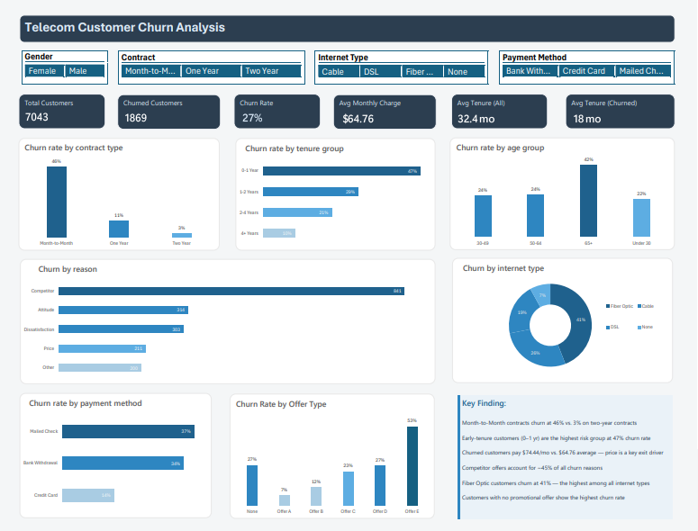
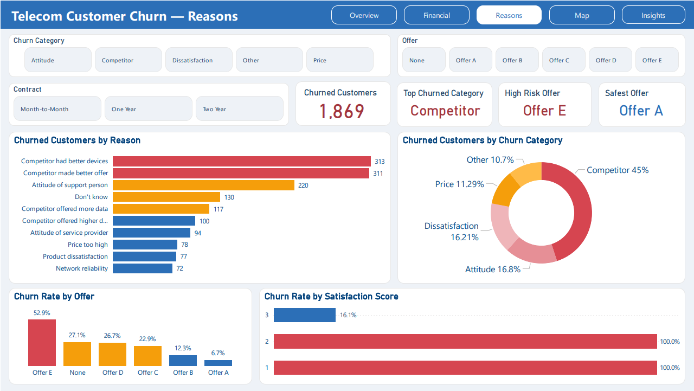
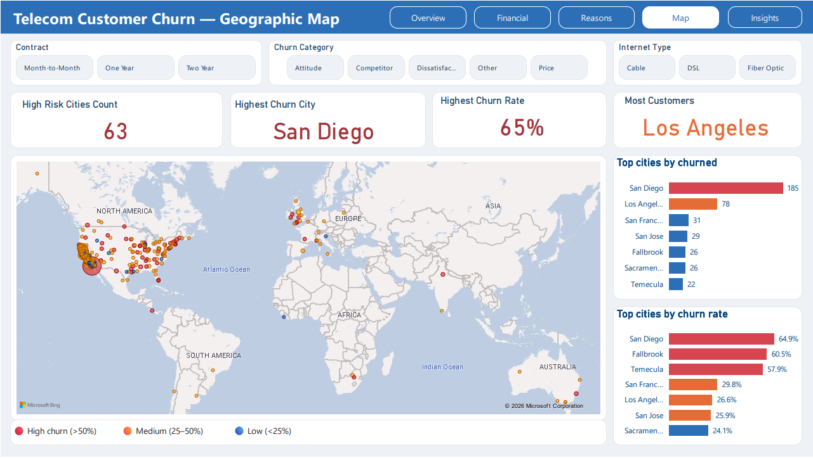

# 📊 Telecom Customer Churn Analysis (Excel + Power BI)

End-to-end analysis of 7,043 telecom customers to identify churn drivers, high-risk segments, and revenue risks using both Excel and Power BI.
The project was implemented in two stages: exploratory analysis in Excel and advanced interactive dashboards in Power BI.

## 📌 Project Overview

Customer churn is one of the most critical challenges in the telecom industry.
This project explores who is churning, why they are leaving, and how the company can reduce churn and protect revenue.

The analysis was conducted using two approaches:

Excel → Data cleaning, pivot analysis, and exploratory dashboard
Power BI → Advanced interactive dashboards and business storytelling
🎯 Business Questions Answered
What is the overall churn rate and key drivers?
Which contract types and customer segments are most at risk?
How do tenure, pricing, and service types affect churn?
What are the main reasons customers leave?
Which segments contribute most to revenue risk?
📊 Dataset
Detail	Value
Source	Telecom Customer Churn Dataset (California)
Total Customers	7,043
Churned Customers	1,869
Overall Churn Rate	~27%
Features	51 columns (demographics, services, billing, churn reasons)
🛠 Tools & Technologies
Excel Analysis
Microsoft Excel
Power Query
Pivot Tables
KPI Cards
Conditional Formatting
Dashboard Design
Power BI Analysis
Power BI Desktop
DAX Measures
Data Modeling
Interactive Dashboards
Data Visualization
## ⚙️ Methodology
1. Data Preparation
Data cleaning and handling missing values
Feature engineering (Age Group, Tenure Group, Revenue Group)
Churn encoding (Yes/No → binary format)
2. Excel Analysis (Exploratory Phase)
Pivot table analysis across key dimensions:
Contract type
Tenure groups
Payment methods
Internet type
Built interactive Excel dashboard using slicers and KPI cards

## 📈 Excel Dashboard Output:

Churn patterns across customer segments
Early identification of high-risk groups
3. Power BI Analysis (Advanced Phase)
Built interactive dashboards with multiple pages:
Overview
Financial Analysis
Churn Reasons
Geographic Insights
Recommendations
Applied DAX measures for KPI calculations
Designed business storytelling dashboards

## 📊 Power BI Output:

Deeper segmentation of churn drivers
Revenue risk analysis
Geographic churn concentration
## 📸 Dashboards Preview
 ## Excel Dashboard

 ## 📊Power BI Dashboard Pages

### 🔹 Overview

**Key takeaway:** Month-to-Month contracts have the highest churn rate (45.8%), making contract type the strongest churn driver.

---

### 💰 Financial Analysis

**Key takeaway:** High-value customers churn at 34.7%, representing the highest revenue risk segment.

---

### ⚠️ Churn Reasons

**Key takeaway:** Competitor-related reasons account for 45% of total churn, mainly due to better offers and devices.

---

### 🌍 Geographic Analysis

**Key takeaway:** Several cities exceed 60% churn rate, indicating strong geographic concentration of customer loss.

---

### 📌 Insights & Recommendations

**Key takeaway:** Retention strategies like long-term contracts and targeted offers can significantly reduce churn.

---

## 🔗 Live Interactive Dashboard

https://app.powerbi.com/groups/me/reports/347cc586-915d-4abf-bd7e-d28adf7495d0?ctid=def512e0-feee-407d-be2f-f68c954e75b7&pbi_source=linkShare
---

## 🔍 Key Insights

* Month-to-Month customers churn 4x more than long-term contracts
* Fiber Optic users have the highest churn rate (40.7%)
* High-value customers contribute significantly to revenue loss
* Competitors are the primary driver of churn
* Churn is concentrated in specific high-risk locations

---

## 💡 Business Recommendations

* Encourage long-term contracts through discounts and bundles
* Improve Fiber Optic service quality and pricing
* Launch targeted retention campaigns for high-value customers
* Compete with better offers, bundles, and device deals
* Focus retention strategies on high-risk cities

## 📁 Repository Structure
telecom-churn-analysis/
├── README.md
├── /Data
│   ├──dataset.csv
├── /EXCEL
│   ├──teleco.xlsx
│   ├── Dashboard.png
├── /POWER BI
│   ├── /Dashboard
│   │   ├── Overview.png
│   │   ├── Financial.png
│   │   ├── Maps.png
│   │   ├── Insights.png
│   ├──telco.pbix
## 🚀 How to Use
Excel Version:
Download teleco.xlsx
Open in Excel (2016+ recommended)
Navigate to Dashboard sheet
Use slicers to explore insights
Power BI Version:
Download telco.pbix file
Open in Power BI Desktop
Interact with dashboards and filters

📍 Egypt
💼 LinkedIn: Profile

📧 Email: youssefmramadan0.0@gmail.com
