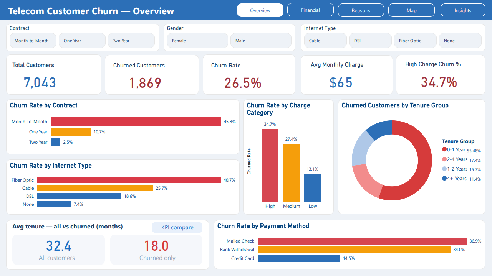
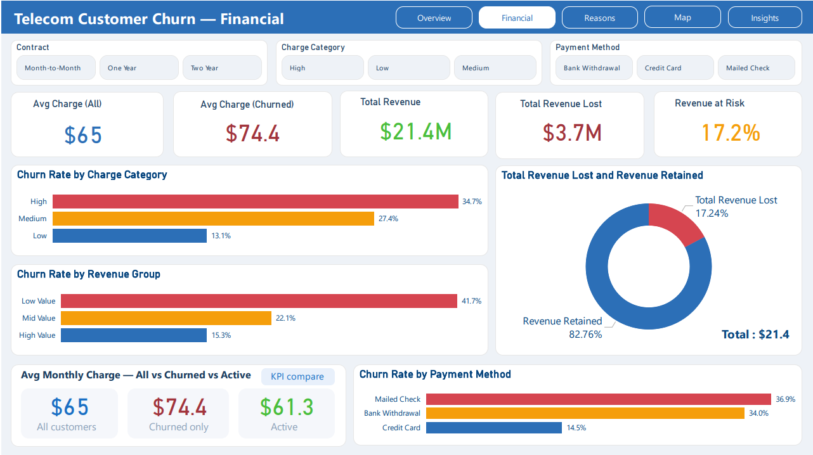
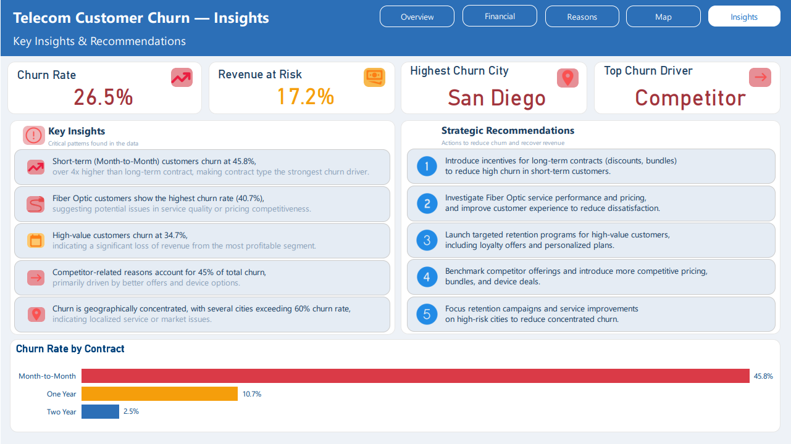

# 📊 Telecom Customer Churn Analysis (Excel + Power BI)

## 📌 Project Overview

This project analyzes customer churn in a telecom company using both **Excel and Power BI**.  
The goal is to identify key drivers behind customer loss, highlight high-risk segments, and provide actionable recommendations to reduce churn and protect revenue.

The project was implemented in two stages:
* **Excel** → Data cleaning, exploratory analysis, and initial dashboard  
* **Power BI** → Advanced interactive dashboards and business storytelling  

---

## 🎯 Key Metrics

* Total Customers: 7,043  
* Churned Customers: 1,869  
* Churn Rate: ~27%  
* Revenue at Risk: 17%+  

---

## 📸 Dashboard Preview

### Excel Dashboard
 

### Power BI Dashboard

---

## 🔗 Live Interactive Dashboard

https://app.powerbi.com/groups/me/reports/347cc586-915d-4abf-bd7e-d28adf7495d0?ctid=def512e0-feee-407d-be2f-f68c954e75b7&pbi_source=linkShare

---

## 📊 Dashboard Pages (Power BI)

### 🔹 Overview
 
*Key takeaway:* Month-to-Month contracts have the highest churn rate (~46%), making contract type the strongest churn driver.

---

### 💰 Financial Analysis
 
*Key takeaway:* High-value customers churn at ~34.7%, representing the highest revenue risk segment.

---

### ⚠️ Churn Reasons
  
*Key takeaway:* Competitor-related reasons account for ~45% of total churn.

---

### 🌍 Geographic Analysis
  
*Key takeaway:* Certain cities exceed 60% churn rate, showing strong geographic concentration.

---

### 📌 Insights & Recommendations
 
*Key takeaway:* Retention strategies like long-term contracts and targeted offers can significantly reduce churn.

---

## ⚙️ Methodology

### 1. Data Preparation
* Data cleaning and preprocessing  
* Feature engineering (Age Group, Tenure Group, Revenue Group)  
* Churn encoding (Yes/No → binary)  

---

### 2. Excel Analysis (Exploratory Phase)
* Pivot table analysis across:
  * Contract type  
  * Tenure groups  
  * Internet type  
  * Payment methods  
* Built interactive dashboard using slicers and KPI cards  

---

### 3. Power BI Analysis (Advanced Phase)
* Built multi-page interactive dashboards  
* Created DAX measures for KPIs  
* Designed data storytelling visuals  

---

## 🔍 Key Insights

* Month-to-Month customers churn ~4x more than long-term contracts  
* First-year customers are the highest-risk group (~47%)  
* Fiber Optic users have the highest churn rate (~41%)  
* Competitors drive ~45% of churn cases  
* High-value customers contribute significantly to revenue loss  
* Churn is concentrated in specific high-risk regions  

---

## 💡 Business Recommendations

* Encourage long-term contracts through discounts and bundles  
* Improve Fiber Optic service quality and pricing  
* Launch targeted retention campaigns for high-value customers  
* Compete with better offers and bundles  
* Focus on high-risk regions and customer segments  

---

## 🛠 Tools Used

### Excel
* Microsoft Excel  
* Power Query  
* Pivot Tables  
* Dashboard Design  

### Power BI
* Power BI Desktop  
* DAX  
* Data Modeling  
* Data Visualization  

---

## 📁 Repository Structure

telecom-churn-analysis/
* README.md  
* Data/
  * dataset.csv  
* EXCEL/
  * teleco.xlsx
  * Dashboard.png
* PowerBI/
  * telco.pbix  
  * Dashboard/   
     * Overview.png  
     * Financial.png
     * Reasons.png  
     * Maps.png
     * Insights.png  

---

## 🚀 How to Use

### Excel Version:
1. Download `teleco.xlsx`  
2. Open in Excel  
3. Navigate to Dashboard sheet  
4. Use slicers to explore  

### Power BI Version:
1. Download `.pbix` file  
2. Open in Power BI Desktop  
3. Interact with dashboards  

---

## 👤 Author

**Youssef Mohamed**  
Data Analyst 

📍 Egypt  
💼 https://www.linkedin.com/in/youssef-mohamed00/  
📧 youssefmramadan0.0@gmail.com  
